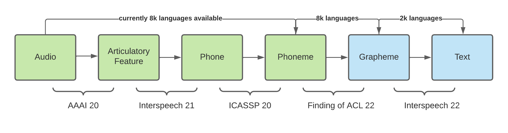

# ASR2K

This repository will contain our code of our publication at `interspeech 2022`

```
Li, Xinjian, et al. "ASR2K: Speech Recognition for Around 2000 Languages without Audio" Interspeech 2022. 2022
```

We plan to release ASR models for 2k languages (currently 1909 languages). The architecture is as follows:




It has a modular architecture instead of modern end-to-end models

As most of the languages do not have any training set (and even test set), it is impossible to create any end-to-end models directly. Instead of building the end-to-end models, We are interested in decomposing the entire model into a sequence of linguistic components. it has a few advantages in this scenario:

- some of the components here are relatively less dependent on training resources (e.g: texts are easier to obtain than audios)
- some of them are already well-defined by linguists (e.g: phonetics, phonology), those domain knowledge can be incorporated into the model through some Bayesian frameworks.
- language-wise interpolation is easier sometimes (e.g: English and German shares many common phones)

## Model

Our model mainly consists of three components: acoustic model, pronunciation model and language model. The acoustic model and pronunciation model have been released separately on Github:

- acoustic model: [allosaurus](https://github.com/xinjli/allosaurus)
- pronunciation model: [transphone](https://github.com/xinjli/transphone)

The language model is based on [icefall](https://github.com/k2-fsa/icefall) recipes and [crubadan](https://github.com/kscanne/crubadan) database. We are currently working on releasing the language model and organize all codes into a simple codebase in this repository